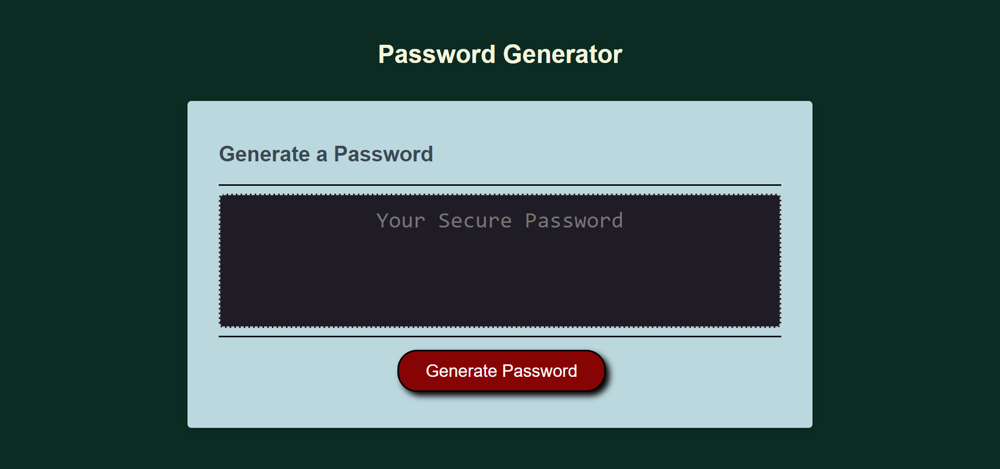

Password Generator made using JavaScript.

 - Clicking on the generate password button will present a series of prompts.
 - Prompts will clarify the users preferences for password length and use of character types.
 - Should the users input be invalid they will be alerted as to why and need to start over.
 - When all prompts are answered a password is generated matching the selected criteria.
 - The password is then displayed on the page.

https://bgrowcott.github.io/bg-password-generator/